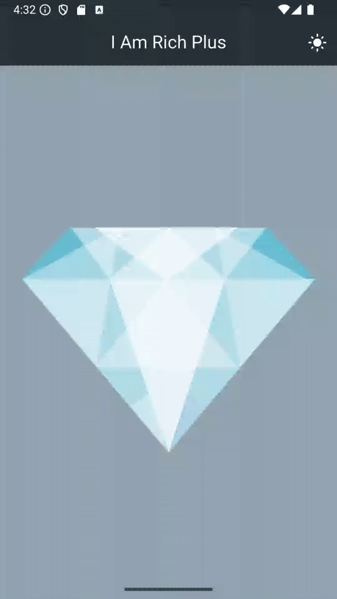

# i_am_rich_plus

## 목적
- 화면 코드와 테마를 **관심사별로 분리**해서, 실제 앱처럼 관리하는 연습

## 기능
- 원본과 같은 단일 화면 표시
- 'theme', 'darkTheme', 'themeMode'를 설정해서 light/dark 모드를 지원 할 수 있는 구조
- AppBar 스타일을 한 곳에서 정의해서 화면마다 반복 설정하지 않도록 설계
- AppBar에 IconButton으로 테마 토글 

## 데모 영상

## 강의 원본
- https://github.com/nohyam/flutter-lecture-lab/tree/main/i_am_rich